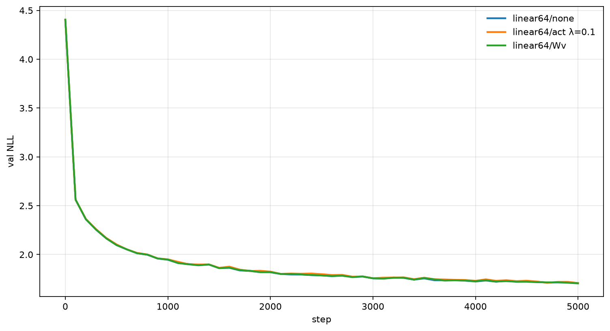
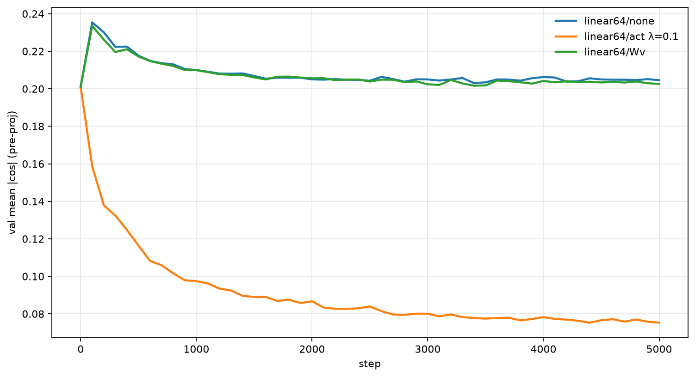
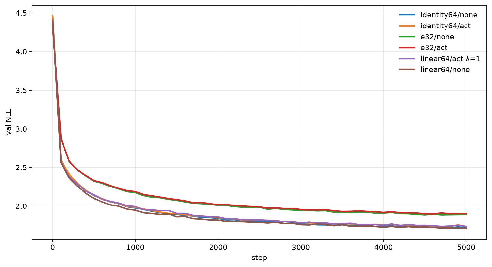
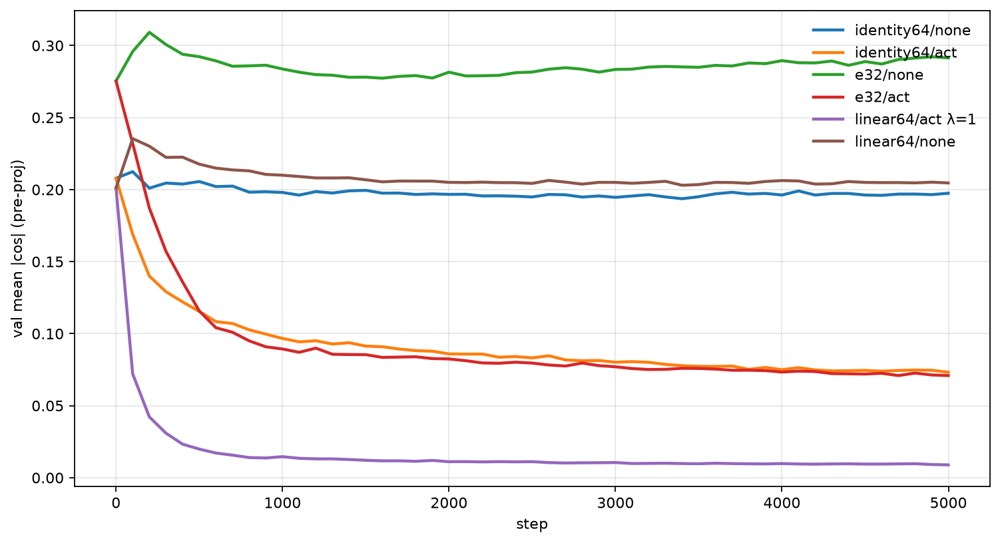
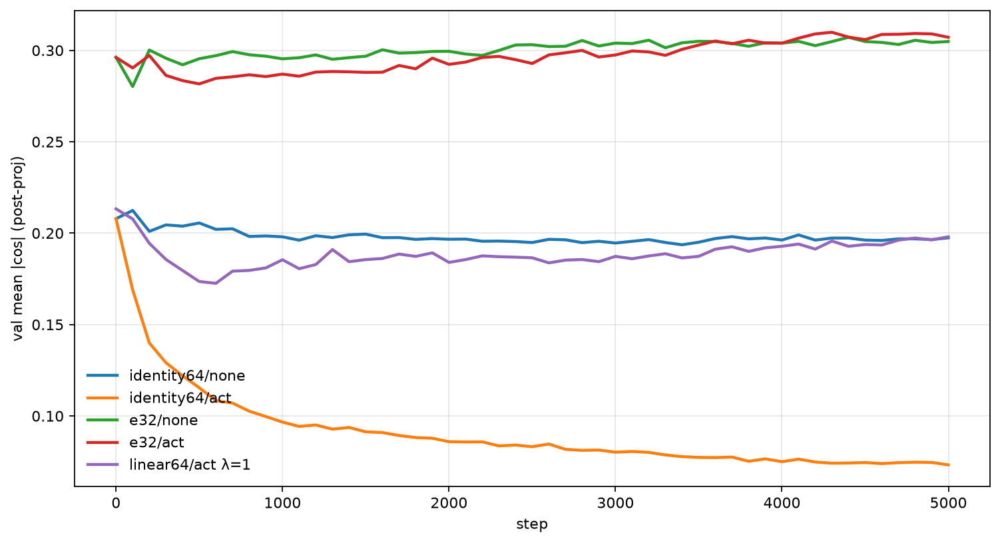

# Orthogonal Multi-Head Attention Experiment

A small character-level Transformer (Tiny Shakespeare) with a Gram-matrix penalty that pushes attention heads toward orthogonality. The question is whether disjoint heads use concatenated dimensions more efficiently and improve language-modeling loss.

## Hypothesis

In multi-head attention, several head outputs are concatenated into one residual-stream vector. If those heads are correlated, some of that width is redundant. The output projection can mix the redundancy away, so the model still trains, but you have paid for dimensions you did not use.

The claim: penalize off-diagonal cosine similarity between heads so they sit near 90°, and the extra width should become useful features rather than copies.

On a vanilla concat model the heads are only mildly aligned. Mean absolute pairwise cosine is about **0.20** (~78°), not a pile of duplicate heads.

## What the first scripts did not test

`train.py`, `train_ortho_act.py`, and `train_ortho_wv.py` are the original notebooks-in-files. They are not a controlled comparison:

- `train_ortho_act.py` **summed** the four 16-d heads and projected `16 → 64`. Vanilla **concatenated** and projected `64 → 64`. Different mixer, different rank, different init RNG.
- The \(W_v\) run used **2000** steps against **5000** for vanilla.
- Flattening each `W_v` and orthogonalizing those matrices does not make per-token head activations orthogonal.
- Eval batches shared the training RNG.

The plots under `outputs_*` and `comparison_plots/` are from that first pass. Do not read them as the result of this repo.

The matched experiment lives in `ortho_attn/` and was run on Kaggle from branch `kaggle/controlled-ortho`.

## Controlled setup

Same decoder for every variant: 4 layers, 4 heads, concat, then `Linear(n_embd, n_embd)` unless noted. Tiny Shakespeare, context 32, batch 64, AdamW `1e-3`, 5000 steps, seed 1337. Eval uses a separate generator so it does not steal training batches.

Penalty: mean ReLU(|cos| − margin) on off-diagonal Gram entries of L2-normalized head vectors, `margin = 0`, warm-up 500 steps.

```text
python -m pytest tests -q
python -m ortho_attn.train --ortho none --output-dir runs/none
python -m ortho_attn.train --ortho act  --output-dir runs/act
python -m ortho_attn.train --ortho wv   --output-dir runs/wv
```

## Results

All numbers below are **val NLL** at step 4999, one seed. Pairs in a row are param-matched.

### Same architecture, extra loss only





| Variant | Params | Val NLL | Mean \|cos\| (pre-proj) |
|---|---|---|---|
| none | 209729 | **1.707** | 0.205 |
| act (λ=0.1) | 209729 | 1.708 | **0.075** |
| Wv | 209729 | 1.705 | 0.203 |

The activation penalty moves cosine. It does not move NLL. Orthogonalizing flattened `W_v` zeros that penalty and leaves **activation** cosine where vanilla is.

### Follow-ups

The original writeup said the output projection hides redundancy, and that a smaller model might need disjoint heads. Those two, plus a harder penalty:







| Setup | Params | Val NLL | Pre-proj \|cos\| | Post-proj \|cos\| |
|---|---|---|---|---|
| identity proj, none | 193089 | **1.713** | 0.197 | 0.197 |
| identity proj, act | 193089 | 1.732 | 0.073 | 0.073 |
| n_embd=32, none | 55745 | **1.892** | 0.291 | 0.305 |
| n_embd=32, act | 55745 | 1.902 | 0.071 | 0.307 |
| linear 64, act λ=1 | 209729 | 1.734 | **0.009** | 0.198 |

- Dropping the output projection does not make orthogonality useful. Vanilla without `proj` is already 1.713; the penalty makes val **worse**.
- Width 32 is just a worse language model for both. Vanilla heads get *more* correlated; forcing them apart still does not help NLL.
- λ=1 drives pre-proj cosine to ~0.009 and NLL to 1.734 (slightly worse than 1.707).
- With a linear `proj`, post-proj cosine stays ~0.20–0.31 even when pre-proj cosine is 0.07 or 0.009. The residual stream does not keep the orthogonal code.

## Takeaways

1. **The regularizer works.** You can make concatenated heads nearly orthogonal.
2. **That capacity is not used as extra signal on this task.** Matched NLL is unchanged or a little worse.
3. **The output projection remixes the heads.** Pre-proj orthogonality is not what the next layer sees.
4. **Redundancy is not obviously the bottleneck** on Tiny Shakespeare, even without the mixer and even at 32-d.

One seed, so ±0.01 is not a prize. Every matched pair points the same way.

Kaggle jobs (clone this branch, do not inline the trainer):

- https://www.kaggle.com/code/aivenger1st/controlled-ortho
- https://www.kaggle.com/code/aivenger1st/controlled-ortho-followup
