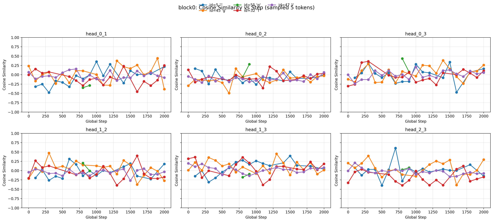
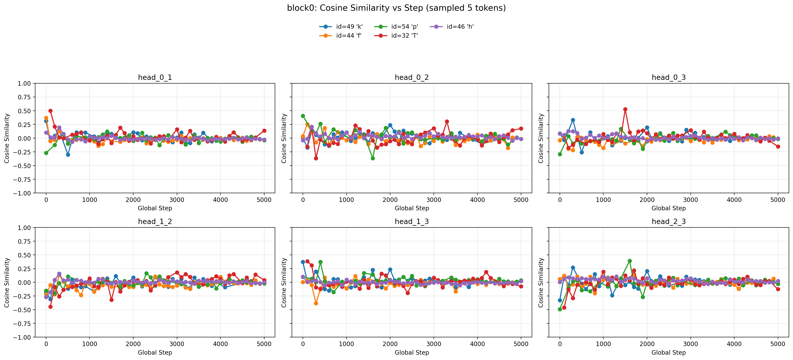
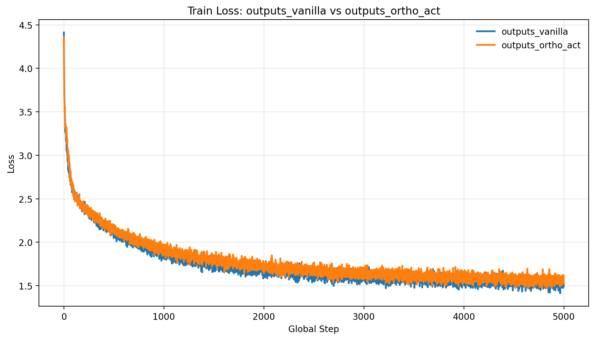
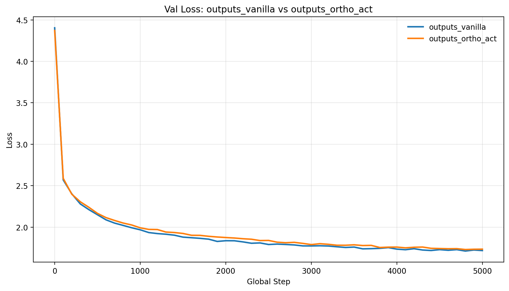

# Orthogonal Multi-Head Attention Experiment

This repository contains an experiment testing a structural constraint on the standard Transformer architecture: forcing attention heads to be orthogonal to maximize dimensional efficiency.

## The Hypothesis

In a standard Transformer, the multi-head attention block computes multiple representations (heads) for the same token and then concatenates them to create a final representation. If you measure the cosine similarity between the outputs of these heads during a standard training run, they often sit between 30 and 90 degrees.

Our hypothesis was that if the heads are highly correlated, we are essentially wasting dimensions. Because we are concatenating these vectors, any shared information could theoretically be represented in a lower-dimensional space. If we can force the heads to be closer to 90 degrees (orthogonal), the learned representation will be much richer because every head is forced to capture completely disjoint, non-redundant information.

## The Intuition

Think about the dimension bottleneck. If we concatenate four 16-dimensional heads into a single 64-dimensional vector, but two of those heads are paying attention to the exact same features, we are paying the memory and compute cost of 64 dimensions while only utilizing the informational capacity of 48 dimensions.

In a vanilla model, the output projection matrix usually cleans up this redundancy. It acts as a feature mixer that squashes redundant information down into a useful representation for the next layer. 

Our intuition was to stop relying on the projection matrix to compensate for lazy, redundant feature learning. By penalizing high cosine similarity between head outputs during the forward pass, we wanted to force the network to be efficient by design.

## The Implementation

To enforce this, we implemented an orthogonal regularization loss using a Gram matrix penalty. 

By calculating the Gram matrix across the heads and penalizing the off-diagonal elements (using a soft margin to allow for slight natural variance), we pushed the cosine similarity of the heads toward zero. We experimented with applying this penalty to both the static Value projection weights and the dynamic per-token activations.

## The Results

Mechanically, the Gram matrix loss worked exactly as intended. We successfully forced the attention heads to operate in orthogonal subspaces, and the cosine similarity between heads dropped significantly compared to the baseline runs.

However, regarding the actual language modeling performance (training and validation loss), the results were almost identical to the vanilla model. 

We ran several ablation tests to see if this architectural constraint was useful under different conditions:
* Running our standard baseline size.
* Increasing the model size.
* Decreasing the model size (to test if the orthogonal model handled parameter starvation better than the vanilla model).

At every test scale, the task loss of the orthogonal model practically mirrored the vanilla model. There were no massive drops in performance, but there were no significant improvements either.

## Takeaways

This experiment highlighted a few realities about how Transformers optimize:
1. **Capacity vs. Utility:** While we can successfully force the network to maximize its representational capacity, that capacity does not automatically equal utility. If the dataset does not require the full dimension space, the forced heads might just learn orthogonal noise rather than useful features.
2. **The Value of Redundancy:** Deep learning models often use parameter redundancy to smooth out the loss landscape. By forcing strict orthogonality, we strip away the redundant pathways that help the optimizer easily navigate toward convergence.
